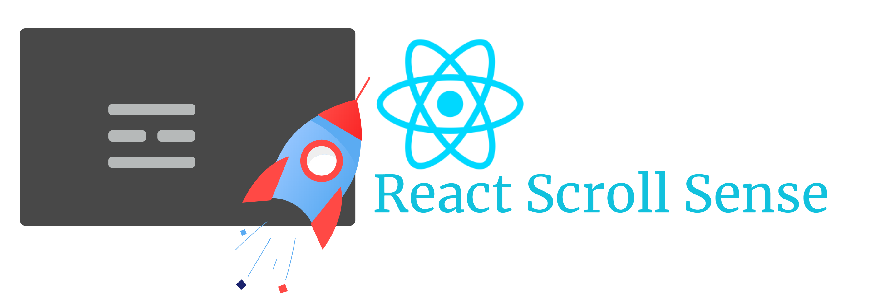

 

# React Scroll Sensor

## Docs are still under development

Wanna create animated sites when they get scrolled up, read on,

 > TLDR; An unopiniated sensor to detect when your component gets into the viewport and inject the intersection info into your component.

 If you ever have tried to implement the support necessory to detect when your components gets into the viewport when scrolling, you know how much it hurts. That's the exact reason this library is here.
 Whether you want to use scroll event based tracking or intersection observer based tracking, it's already packed into this sensor.

## Installing


``` sh
  yarn add react-scrollsense
 ```

 or

``` sh
  npm save react-scrollsense
 ```

## Get Started
Two implementations of the React scroll sensor are available. Both are included in this package. The one based on [scroll event](https://developer.mozilla.org/en-US/docs/Web/API/Document/scroll_event) is the default implementation. [Intersection Provider](https://developer.mozilla.org/en-US/docs/Web/API/Intersection_Observer_API) is used in the other implementation. We'll look at how to choose the best implementation for a specific case in the documentation.

> When you use a sensor make sure that hooks/connector HOCs match the sensor. For example, don't use an intersection observer based useScrollSense hook with a scroll events-based ScrollSensor. If you face an issue, this is the first thing you might need to check.


<i>app.js</i>
```jsx
// for scroll event based implementation, 
import ScrollSensor from 'react-scrollsense';
// Or, for intersection observer implementation use,
// import ScrollSensor from 'react-scrollsense/io';

function App() {

     return (
          <ScrollSensor>
               <!-- Other componets --> 
               <MyAwesomeComponent/>
          </ScrollSensor>
     )
}

export default App;
```

`ScrollSensor` is the provider of scroll implementation and carries the sensor. You can nest it after the router if any, to reinitialize the sensor for each page. We use the popular provider pattern (as with redux) to inject the sensor.

<i>MyAwesomeComponent.js</i>
```jsx
// for scroll event based implementation, 
import {useScrollSense}  from 'react-scrollsense';
// Or, for intersection observer implementation use,
// import {useScrollSense}  from 'react-scrollsense/io';
import {useEffect, useRef} from 'react';

function MyAwesomeComponent() {
     
     const sensor = useScrollSense();
     const ref = useRef();
     const [cls, setCls] = useState('my-component');

     useEffect(() => {

          let tracker = sensor.onIntersection(ref.current, (entry, el) => {

               if(entry.isIntersecting) {
                    // Now its on screen let's change class
                    setCls('my-component scrolled');
               }
               else {
                    // It's off screen
                    setCls('my-component');
               }

          });

          return () => { sensor.detach(tracker)}

     }, []);

     return (
          <div className={cls} ref={ref}>
               Hello, Scroll Me!
          </div>
     )

}

export default MyAwesomeComponent;
```

Then on the target component, use the hook, `useScrollSense()`. This hook connects your component to the `ScrollSensor` and returns a sensor. Then you call `onIntersection()` on the sensor to start tracking the component. 

Usually, you need to call `onIntersection()` inside `useEffect` to make sure that the component has already mounted, and the DOM reference is valid. 

Also,  You can call `detach()` to stop the sensor from tracking your component. A good place to include this is in the return function of `useEffect`. If you return a function from `useEffect`, as you already know, it will be invoked when the component gets unmounted.


## Documentation (In progress)

1. Basic Guide
2. Intersection Observer vs Scroll Events, which?
3. Advanced Guide
4. API
5. Raf and throttling in React Scroll Sense
6. Demos
7. Performance Comparison

See [React Scroll Sense on GitHub](https://github.com/XPD-Kasun/React-ScrollSense) 


## License

 Copyright (c) 2022 XPD::Kasun Jayawardena.

 Licensed under The MIT License (MIT).

* Find it useful? give it a star :)
* Problems? Add your problem in Issues, I will try to accomadate as much as I am allowed to.

