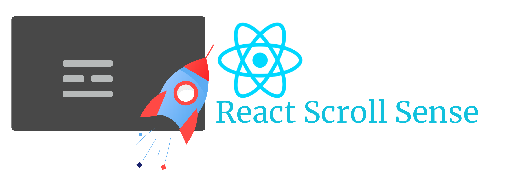

# React Scroll Sensor

This library will help you to add scroll detection to your react application. With this library, you can add animations, effects, and interactions when the user scrolls the webpage. Supports both intersection IO and scroll event-based scroll detection.

 > TLDR; An unopinionated sensor to detect when your component gets into the viewport and injects the intersection info into your component.

 If you ever have tried to implement the support necessary to detect when your components get into the viewport when scrolling, you know how much it hurts. That's the exact reason this library is here.
 Whether you want to use scroll-event based tracking or intersection-observer based tracking, it's already packed into this sensor.

## Installing


``` sh
  yarn add react-scrollsense
 ```

 or

``` sh
  npm save react-scrollsense
 ```

## Getting Started

Two implementations of the React scroll sensor are available. Both are included in this package. The one based on [scroll event](https://developer.mozilla.org/en-US/docs/Web/API/Document/scroll_event) is the default implementation. [Intersection Provider](https://developer.mozilla.org/en-US/docs/Web/API/Intersection_Observer_API) is also packed in. Choosing between them is up to you. You can read on [intersection vs event-based guide](advanced.md#intersection-observer-vs-scroll-events) for more info.

> When you use a sensor make sure that hooks/connector HOCs match the sensor. For example, don't use an intersection observer-based useScrollSense hook with a scroll events-based ScrollSensor. If you face an issue, this is the first thing you might need to check.


<i>app.js</i>
```jsx
import ScrollSensor from 'react-scrollsense';
// Or, for intersection observer implementation use,
// import ScrollSensor from 'react-scrollsense/io';

function App() {

     return (
          <ScrollSensor>
               <MyAwesomeComponent/>
          </ScrollSensor>
     )
}

export default App;
```

`ScrollSensor` is the provider of scroll implementation and contains the sensor. You can nest it after the router (if you use [react-router-dom](https://github.com/remix-run/react-router)) to reinitialize the sensor for each page.

<i>MyAwesomeComponent.js</i>
```jsx 
import {useScrollSense}  from 'react-scrollsense';
// Or, for intersection observer implementation use,
// import {useScrollSense}  from 'react-scrollsense/io';
import {useEffect, useRef} from 'react';

function MyAwesomeComponent() {
     
     const sensor = useScrollSense();
     const ref = useRef();
     const [cls, setCls] = useState('my-component');

     useEffect(() => {

          let tracker = sensor.onIntersection(ref.current, (entry, el) => {

               if(entry.isIntersecting) {
                    // Now its on screen let's change class
                    setCls('my-component scrolled');
               }
               else {
                    // It's off screen
                    setCls('my-component');
               }

          });

          return () => { sensor.detach(tracker)}

     }, [sensor]);

     return (
          <div className={cls} ref={ref}>
               Hello, Scroll Me!
          </div>
     )

}

export default MyAwesomeComponent;
```

Then on the target component, use the hook, `useScrollSense()`. This hook connects your component to the `ScrollSensor` and returns a sensor. Then you call `onIntersection()` on the sensor to start tracking the component. 

Usually, you need to call `onIntersection()` inside `useEffect` to make sure that the component has already mounted and the DOM reference is valid. 

Also,  You can call `detach()` to stop the sensor from tracking your component. A good place to include this is in the return function of `useEffect` hook. The returned function from `useEffect` will be invoked when the component gets unmounted.


## Documentation

1. [Basic Guide](guide.md)
2. [Advanced Guide](advanced.md)
3. [Helpers](helpers.md)
4. [Demos](demo.md)
5. [Reference](reference.md)
6. [License](license.md)

Licensed under The MIT License (MIT).
Copyright &copy; (c) XPD Kasun Jayawardena
